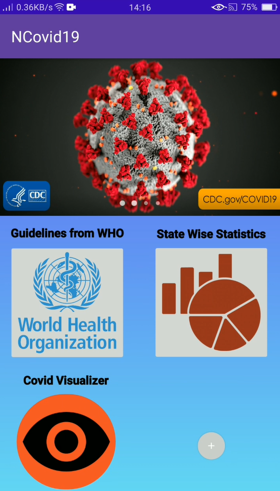

# NCovid19 Android Application Prototype

An Android Application prototype which provides information on Novel COVID-19 and its spread.

## My first project

My first mini project which I started during the lockdown. This project was implemented for IEEE Bangalore Section's COVID-19 App Development contest.
I didn't win the contest, but it was a fantastic experience and there was so much learning. I got introduced to Android Studio a superb system software to develop Android applications. I even got to learn Java through this project. 
I understood how much it takes to make an app and I respect all the Android App Developers out there!
 
## Tools and Software Used

   1)  Android Studio
   2)  Java

## Demo

A small demo of the Android App: https://youtube.com/shorts/bJxuAk8MkBY

## Acknowledgements

 - [WHO guidance publications](https://www.who.int/emergencies/diseases/novel-coronavirus-2019/technical-guidance-publications)
 - [Covid Visualizer](https://www.covidvisualizer.com/)
 - [State wise statistics](https://www.mohfw.gov.in/)
 - [Android Studio User Guide](https://developer.android.com/studio/intro)

